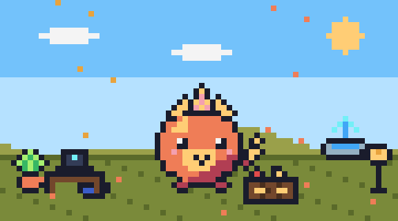
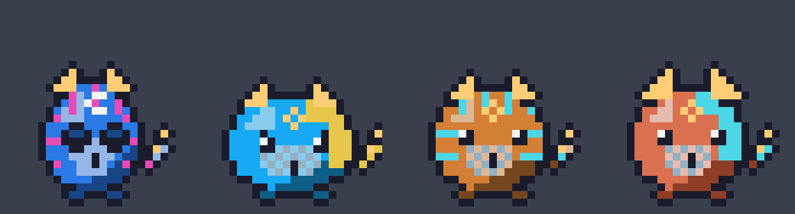
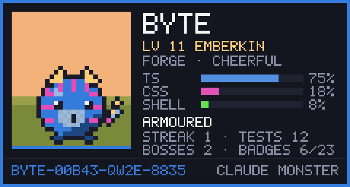
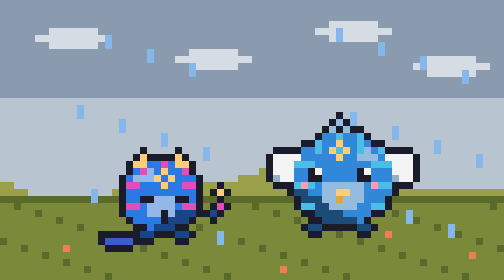
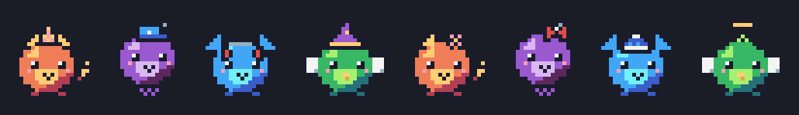
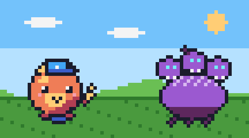
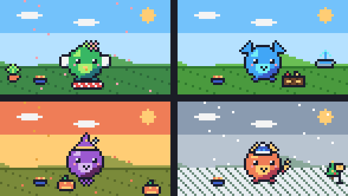
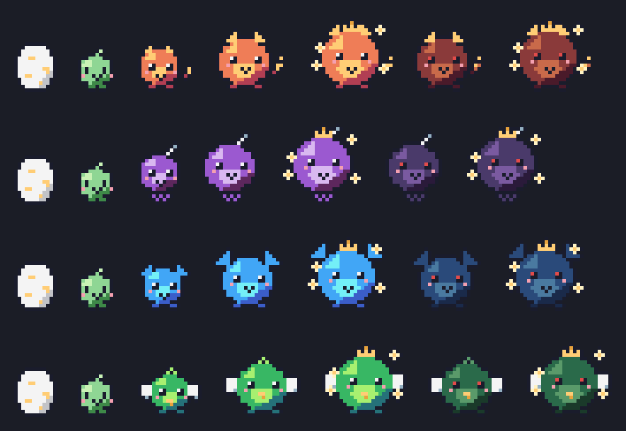

# Claude Monster Pet

A Claude Code mod that hatches a pixel-art digital monster and raises it from your work. Tokens feed it, passing tests and commits cheer it up, failed commands stress it, and the way you work decides what it evolves into.



## Install

In a Claude Code terminal session (Claude Code 2.1.287 or later):

```
/plugin install monster --marketplace K-Mertin/claude-monster-pet
```

Answer `y` to add the marketplace, then pick a scope. The egg appears above your prompt.

## Use

- The band above the prompt shows your monster with its food, joy, energy and XP, plus what it is up to.
- The band has ♥ (pat) and 💬 (talk) buttons.
- `/pet` opens its habitat, where it strolls about under the season's weather. Six tabs:
  - **Home**: Feed, Play, Pat, Talk, Clean (after meals it makes a mess), Tuck in (it sleeps and recovers), sound and alert toggles
  - **Items**: treats earned from your work, each with its own effect
  - **Games**: the weekly Bug Boss, a three-round treat hunt with prizes, and training for Power, Wisdom and Speed
  - **Shop**: spend gems on decorations for the habitat
  - **Style**: hats unlocked by badges
  - **Badges**: 23 achievements, each announced with a toast, and the Hall of Fame
- New here? Tips appear above your prompt, the habitat shows what to do **next**, and `/pet help` lists every command.
- Commands: `/pet help`, `/pet card`, `/pet visit [<code>|play|spar|bye]`, `/pet feed|play|talk|clean|tuck`, `/pet hunt [left|middle|right]`, `/pet boss [strike|outsmart|dodge]`, `/pet use cookie|coffee|gem|bug`, `/pet train power|wisdom|speed`, `/pet buy <decoration>`, `/pet hat <hat>|none`, `/pet retire`, `/pet name <name>`, `/pet sound on|off`, `/pet alerts on|off`, `/pet hide|show`

## Your monster's DNA

From the child stage on, your habits draw your monster, so no two look alike, even on the same evolution line:



| Habit | Becomes |
| --- | --- |
| Your main language (by file extension) | Its colour; the more you stick to one language, the bolder it gets |
| Your second language | The colour of its pattern |
| The hours you work | A forehead mark: a moon for night owls, a sun for early birds, a star for steady hours |
| Edits per commit | Its build: small frequent commits make it slim, big ones stout |
| Passing tests | Armour scales on its belly |
| Few errors, late nights, lots of research | Sharp eyes, sleepy eyes, glasses |
| A 30-day streak | A red scarf |
| Who you are (a hash of your git email) | Its exact tint, pattern style and placement, horn length, and a one-in-256 chance of a shiny gold colouring |

The Style tab explains each trait and where it came from. Only counts are kept: languages by extension, active hours, commit sizes and test results, plus a hash of your git email. No file paths, code, messages or the email itself.

## Share your card

`/pet card` saves a pixel card of your monster as `~/.claude/monster/card.png` and opens it: its form, languages, habits, record and a DNA code. The Style tab shows a preview.



The DNA code (like `BYTE-00B43-QW2E-8835`) holds its seed and traits.

## Friends' visits



Swap DNA codes with a friend. `/pet visit <their code>` brings their monster to stay for a day, drawn from the code and strolling beside yours. Play together for joy and XP, or have a friendly spar (stage and skills decide it, with a little luck), once each per visit. `/pet visit` shows your own code to share. No server: just copy and paste.

## Hats

Badges unlock eight hats: party hat, cap, headphones, wizard hat, flower, bow, beanie and halo.



## The weekly Bug Boss



Each week a boss forms from your previous week's failures: a Lint Imp after a clean week, a Stacktrace Golem after broken commands, a Flaky Hydra after failing tests, a Regression Kraken after a rough week. Fight it turn by turn with Strike (Power), Outsmart (Wisdom) and Dodge (Speed); each turn it shows which move hits hard. Beat it for 3 gems, 30 xp and a badge. From the child stage on.

## Secret forms and generations

Extreme habits unlock hidden forms: **Archivist** (a Scribe with 50 Wisdom), **Bugslayer** (3 bosses beaten), **Goldheart** (a 30-day streak). After 30 days as an ultimate your monster can retire to the Hall of Fame; the next egg keeps your badges, hats, items and decorations, and inherits a head start in its best skill.

## The habitat



Seasons and daily weather follow your calendar (blossoms, sun, falling leaves, rain, snow), with Halloween pumpkins, a Christmas tree, New Year fireworks and a cake on its birthday. Gems buy a flower pot, lantern, sign, picnic rug, bed, toy box, desk with a laptop and a fountain. It naps in its bed if it has one.

## How it grows

| Your work | Effect |
| --- | --- |
| Tokens Claude processes | Food and XP; a ☕ coffee every 50k tokens |
| Passing test runs | Joy, XP and a 🍪 cookie; a 🐛 bug snack when a failing test passes again |
| Git commits and pushes | Joy, XP and a 💎 gem |
| Finished todo items | Joy and XP |
| New subagents | It waves at them |
| Failed or denied commands | Stress; too much makes it sick, and it recovers over time |
| A new day of work | A daily gift and a growing streak, with gems at 3, 7 and 30 days |
| Hours away | It gets hungry and sleeps. It never dies. |

Stages: egg → baby (Lv 1) → child (Lv 4) → adult (Lv 10) → ultimate (Lv 20).

At the child stage it picks an evolution line from how you have worked:



| Line | When | Looks | Adult (bright / shadow) | Ultimate (bright / shadow) |
| --- | --- | --- | --- | --- |
| Forge | mostly shell commands | horns, flame tail | Emberkin / Cinderhorn | Solforge / Ashtyrant |
| Scribe | mostly reading and editing code | a floating ghost with a quill | Quillwisp / Inkshade | Lorewraith / Hexscript |
| Summoner | many subagents | big ears | Callpup / Hollowear | Choirlord / Legionmaw |
| Wanderer | lots of web research | wings and a beak | Skylark / Duskwing | Zephyrus / Stormcrow |

How well you care for it decides whether its adult form is bright or shadow. Each monster also hatches with a personality (cheerful, lazy, curious or grumpy) that colors what it says.

There is one monster per machine, shared by every session, saved in `~/.claude/monster/pet.json`. The mod makes no model calls and no network requests.

## Develop

```
claude --plugin-dir .
claude plugin validate .
claude plugin test .
```
